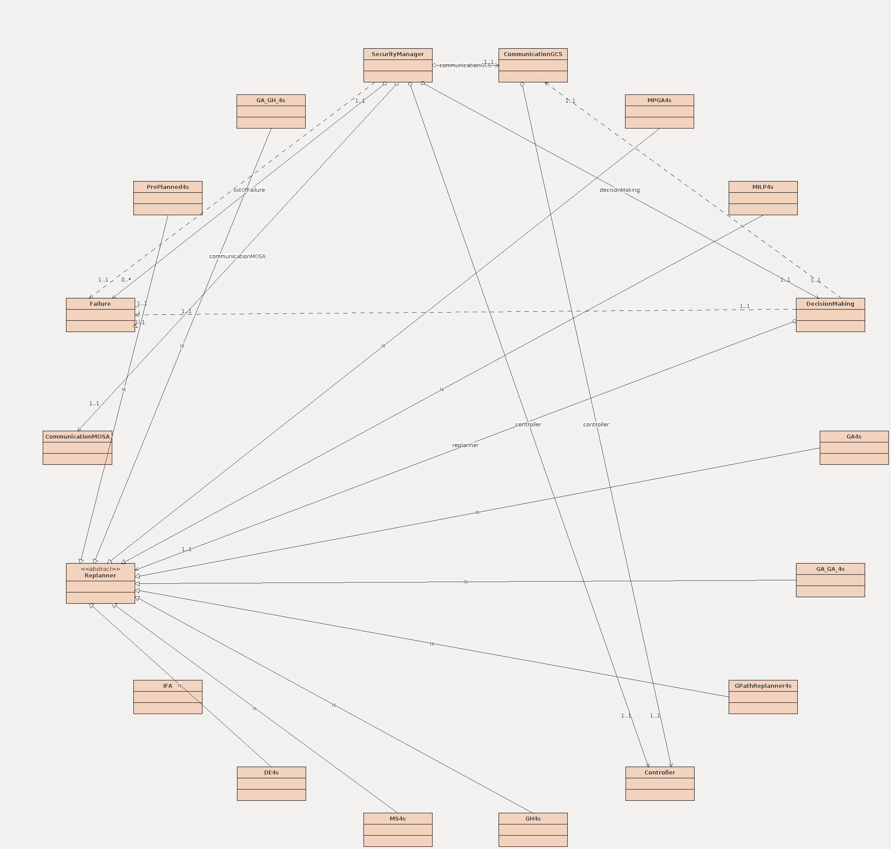
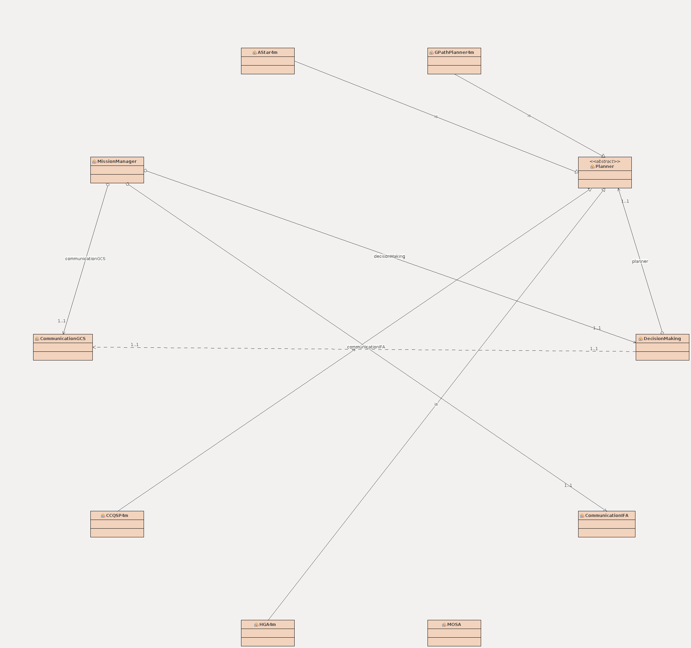
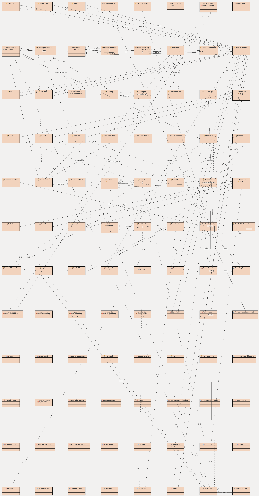
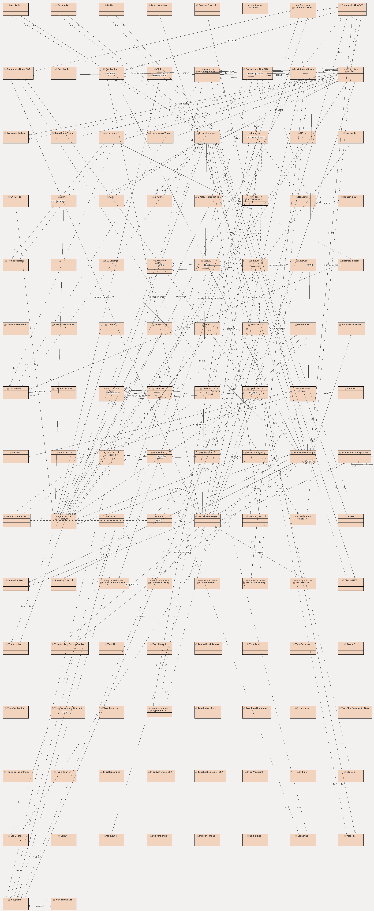
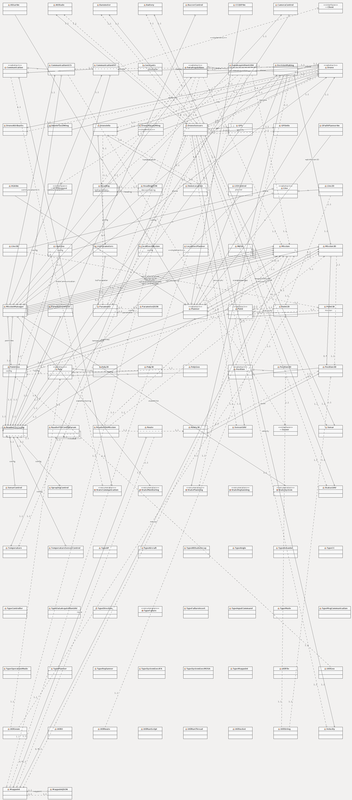

# Configurações

Abaixo encontram-se um conjunto de configurações de hardware, software utilizadas. Alguns diagramas de classes também estão presentes.

## Rádio Controle 

Abaixo encontram-se alguns modos de voos configurados nos rádios controles.

| SWC | SWD | Modo    |
|-----|-----|---------|
| 1   | 1   | LOITER  |
| 2   | 1   | RTL     |
| 3   | 1   | AUTO    |
| 1   | 2   | LOITER  |
| 2   | 2   | RTL     |
| 3   | 2   | AUTO    |

## Arquitetura de Hardware

## Arquitetura de Software

## Arquitetura de Comunicação

## Diagrama de Classes

Diagrama de Classes do IFA

Diagrama de Classes do MOSA

Diagrama de Classes do Lib-UAV Completo

Diagrama de Classes do IFA Completo

Diagrama de Classes do MOSA Completo

