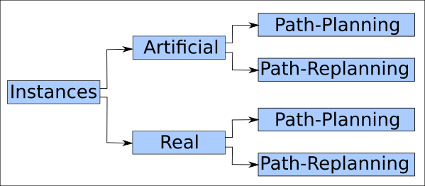

# Instances

Este diretório agrupa um conjunto de arquivos de instâncias Artificiais e Reais utilizadas nos planejadores e replanejadores.

* Instancias Artificiais: Foram geradas de forma automática por algum algoritmo (programa localizado [aqui](https://github.com/jesimar/UAV-Tools/tree/master/CreateMapArtificial)).

* Instancias Reais: Foram geradas de forma manual, em geral, usando o Google Earth e usando o software [UAV-Mission-Creator](https://github.com/jesimar/UAV-Toolkit/tree/master/UAV-Mission-Creator).

A Figura abaixo dá uma visão geral dos arquivos de instâncias disponibilizados nesse diretório.



## Formatos de Saídas: 

* SGL -> formato próprio de mapa - utilizado pelo ProOF. Padrão, mais leve, porém também mais difícil de entender e de ler.
* JSON -> formato padrão de mapa fácil de entender e ler. Padrão, mais pesado que o SGL, ocupa o quádruplo do SGL em disco (HD).
* XML -> formato padrão de mapa fácil de ler. Padrão mais pesado, em geral, ocupa o dobro do tamanho do JSON em disco (HD).

## Arquivo de Instância do Path Planner:

Os valores das coordenadas utilizadas são cartesianas.
Utilizado no planejador de rotas: HGA4m.

```
<number of polygons>
6
<x..., y..., n = 4, id = 0, type = nfz>
-0.1574530915090589,35.683493236344965,35.76497352100013,-0.29027759355372845
0.18960489221798285,-0.20113919146741488,-3.590007201222733,-3.1303520957103608
<x..., y..., n = 4, id = 0, type = nfz>
-0.13697045585684411,2.7159695135371034,2.688223095078793,-0.006680790582055828
-2.8846638150184924,-2.92419757186272,-9.645645524801244,-9.645732521797555
<x..., y..., n = 4, id = 0, type = nfz>
32.66175233327787,32.76904558271187,35.66068100343954,35.74171183095551
-9.935302864599567,-3.3971705583698513,-3.27882987018375,-9.971451659932168
<x..., y..., n = 4, id = 0, type = nfz>
-0.08562668434207914,35.76294020677896,35.74002871834279,-0.13039356655633066
-9.426170508596003,-9.783270640742897,-12.856028962402823,-12.471999223221738
<x..., y..., n = 4, id = 0, type = nfz>
14.901128378151062,14.899784908422248,13.329448947164504,13.254233659495148
-3.161140026479857,-6.648586038235425,-6.648639731077173,-3.161194968543261
<x..., y..., n = 4, id = 0, type = nfz>
18.8915941927357,18.93777932696633,20.508115099753994,20.507021774555028
-9.790579190714476,-6.290114975736857,-6.290060849773693,-9.790524335512249
```

## Arquivo de Instância do Path Replanner:

Os valores das coordenadas utilizadas são cartesianas.
Utilizado no replanejador de rotas: MPGA4s, GA4s, GH4s, DE4s, etc.

```
<number of polygons>
7
<number of nfz>
6
<number of penalty zone>
0
<number of bonus zone>
1
<x..., y..., n = 4, id = 0, type = nfz>
2.3829010559938983,49.24115061768672,49.189630319136874,2.3003630093505167
36.73868927635811,36.66755891079154,34.330884858933295,34.19151035375383
<x..., y..., n = 4, id = 0, type = nfz>
-0.41900629188239247,2.3239958676009502,2.562487255925019,-0.3594149749669098
36.89356242727499,36.89355522135072,2.8420776150670823,2.842076853847313
<x..., y..., n = 4, id = 0, type = nfz>
45.97345505788175,46.450442118731004,49.07417781059031,48.59719590808933
2.4253938349875996,34.45280259896541,34.274218282937625,2.3063357433631073
<x..., y..., n = 4, id = 0, type = nfz>
-0.24535431844210606,48.603549611550434,48.51938699026984,-0.16016917451657317
2.8335819894541596,2.4141193623925066,-0.4227535937246889,-0.010816741829863474
<x..., y..., n = 4, id = 0, type = nfz>
20.207812077507107,14.766815027108319,14.72875139546873,20.097953311464263
13.10931968509494,13.10932693444981,24.358504020906352,24.517925881222638
<x..., y..., n = 4, id = 0, type = nfz>
32.29729165230521,38.260164881451786,38.14265525455766,32.12216586821309
24.087723425534428,24.08772829647234,12.384176778038263,12.65104672450184
<x..., y..., n = 4, id = 0, type = bonus>
5.164413284046982,11.78270493610218,12.102424108805435,5.302163945459722
33.00164862752377,33.11035656792369,26.147003218701542,26.147011223748652
```
