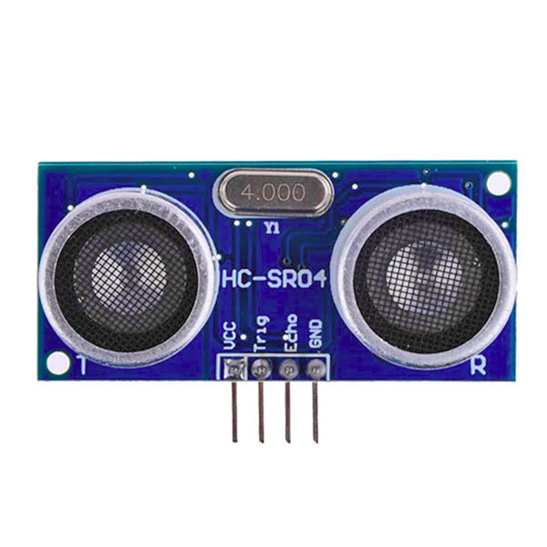
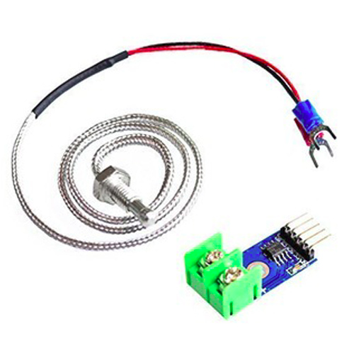
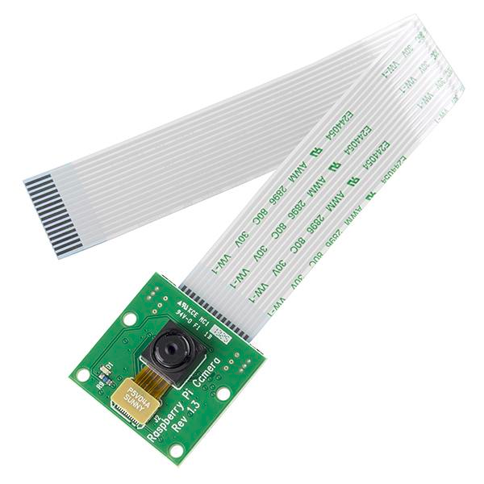
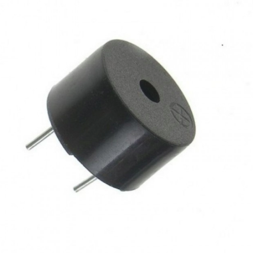
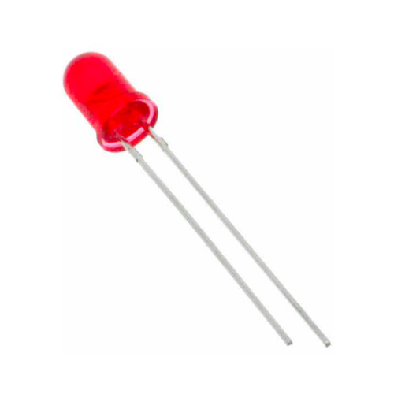
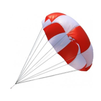

# Modules-Global

Este diretório é responsável por agrupar um conjunto de algoritmos e módulos de hardware usados pelo sistema IFA e MOSA. 

Os diretórios a seguir contém códigos utilizados pelo sistema IFA.

* **Buzzer** -> Código responsável por acionar o alarme do drone após ocorrer uma falha crítica. 
* **Parachute** -> Código responsável por acionar o paraquedas do drone após ocorrer uma falha crítica. 
* **Sonar** -> Código responsável por fazer leituras de distância do drone até o solo.
* **LED** -> Código responsável por acionar ou apagar alguns LEDs do drone.
* **Temperature** -> Código responsável por pegar dados do sensor de temperatura para verificação de superaquecimento do drone.

Os diretórios a seguir contém códigos utilizados pelo sistema MOSA.

* **Buzzer** -> Código responsável por acionar o buzzer do drone após um waypoint específico ter sido alcançado. 
* **Camera** -> Código responsável por fazer a retirada de fotografia e vídeos conforme acionado pelo sistema MOSA.
* **LED** -> Código responsável por acionar ou apagar alguns LEDs do drone.
* **Spraying** -> Código responsável por abrir ou fechar o sistema de pulverização do drone.
* **Route-Simplifier** -> Código responsável por fazer a simplificação de waypoints de forma a tornar mais leve para o piloto automático a execução da rota.

O diretório Files contém arquivos utilizados pelo sistema MOSA e IFA.

* **geoBase.txt** -> Arquivo com as coordenadas de longitude, latitude e altitude usado na transformação para coordenadas cartesianas.
* **featureMission.txt** -> Arquivo que contém as coordenadas de latitude, longitude e altitude, em que deve-se acionar o buzzer, câmera foto, câmera vídeo e spraying.
* **map-full.sgl** -> Arquivo de mapa completo (contendo obstáculos, região penalizadora e região bonificadora) usado pelo sistema.
* **map-nfz.sgl** -> Arquivo de mapa com apenas os obstáculos usado pelo sistema.

## Arquivos de configuração

Este diretório também possui dois arquivos de configuração que são:

* **config-global.properties** -> Arquivo usado pelos sistemas MOSA, IFA, GCS, S2DK para descrever os aspectos gerais da missão/segurança.
* **config-param.properties** -> Arquivo usado pelo sistema IFA para calibrar os parâmetros de voo do Piloto Automático.

## Síntese: 

Abaixo encontra-se uma tabela sintetizando os principais módulos presentes nessa pasta e suas características.

| Característica              | Sonar          | Temperature         | Camera           | Buzzer        | LED           | Parachute     | Spraying      | Route-Simplifier    |
|-----------------------------|----------------|---------------------|------------------|---------------|---------------|---------------|---------------|---------------------|
| Tipo                        | Sensor         | Sensor              | Sensor           | Atuador       | Atuador       | Atuador       | Atuador       | Otimizador de Rotas |
| Marca/Modelo                | HC-SR04        | MAX6675             | Camera RPi v1    | Buzzer 12V    |               |               |               | N/A                 |
| Dependência de Bibliotecas  | RPi.GPIO       | RPi.GPIO e WiringPi | picamera         | mraa          |               |               |               | Não tem             |
| Linguagem                   | Python         | Python ou C         | Python           | Python        |               |               |               | Python              |
| Aplicação que Utiliza       | IFA            | IFA                 | MOSA             | IFA/MOSA      | IFA/MOSA      | IFA           | MOSA          | MOSA                |
| Tem versão PC               | Sim (Simulado) | Sim (Simulado)      | Sim              | Sim           | Não           | Não           | Não           | N/A                 |
| Imagem                      |  | |  |  |  |  |  |  |

| Característica              | Camera                        | Camera                                    | Camera                    |
|-----------------------------|-------------------------------|-------------------------------------------|---------------------------|
| Tipo de Ação                | Retirar Foto                  | Retirar Fotos em Sequência                | Fazer Vídeo               |
| Código para Raspberry Pi    | picture-rpi.py                | photo-in-sequence-rpi.py                  | video-rpi.py              |
| Código para PC              | picture-pc.jar (print screen) | photo-in-sequence-pc.jar (print screens)  | video-pc.jar (grava tela) |

| Característica              | Buzzer                                | Buzzer                               |
|-----------------------------|---------------------------------------|--------------------------------------|
| Tipo de Ação                | Aciona um Beep (Buzzer)               | Aciona vários Beeps (Alarme)         |
| Código para Edison          | buzzer-edison.py                      | alarm-edison.py                      |
| Código para PC              | buzzer-pc.jar (aciona o buzzer do pc) | alarm-pc.jar (aciona o buzzer do pc) |

| Característica              | Sonar                          | 
|-----------------------------|--------------------------------|
| Tipo de Ação                | Calcula Distância              |
| Código para Raspberry Pi    | sonar-rpi.py                   |
| Código para PC              | sonar-pc.jar (dados simulados) |

| Característica              | Temperature                          | 
|-----------------------------|--------------------------------------|
| Tipo de Ação                | Calcula a Temperatura                |
| Código para Raspberry Pi    | temperature-rpi.py                   |
| Código para Raspberry Pi    | temperature-rpi.c                    |
| Código para PC              | temperature-pc.jar (dados simulados) |
