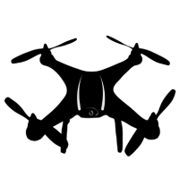
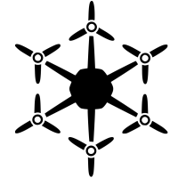

# UAV-Toolkit

<p align="center">
  <a href="#">
    
  </a>
  <a href="https://github.com/jesimar/UAV-Toolkit/tree/master/UAV-IFA">
    
  </a>
  <a href="https://github.com/jesimar/UAV-Toolkit/tree/master/UAV-MOSA">
    
  </a>
  <a href="https://github.com/jesimar/UAV-Toolkit/graphs/commit-activity" target="_blank">
    
  </a>
</p>

Conjunto de ferramentas desenvolvidas para automatização de voos de Veículos Aéreos Não-Tripulados (VANTs) ou *Unmanned Aerial Vehicles* (UAVs).
Entre os principais sistemas aqui desenvolvidos podemos citar o sistema MOSA [[Link da Tese](http://www.teses.usp.br/teses/disponiveis/55/55134/tde-12072016-102631/pt-br.php)] e o sistema IFA [[Link da Tese](http://www.teses.usp.br/teses/disponiveis/55/55134/tde-03122015-105313/pt-br.php)]. O sistema desenvolvido dá suporte aos sistemas operacionais Linux, Mac OS X e Windows.


## Visão Geral

Nesse projeto podemos encontrar os seguintes diretórios:

* **Docs** -> Documentação escrita sobre esse projeto. Dissertação, Qualificação e Tutorial. [[Docs](./Docs/)]
* **Figures** -> Pasta contendo um conjunto de figuras utilizada na documentação. [[Figures](./Figures/)]
* **Instances** -> Conjunto de arquivos de instâncias de mapas artificiais e reais utilizados nos experimentos. [[Instances](./Instances/)]
* **Libs** -> Bibliotecas utilizadas nos projetos aqui descritos. [[Libs](./Libs/)]
* **Missions-Google-Earth** -> Agrupa um conjunto de missões feitas usando o software Google Earth. [[Missions-Google-Earth](./Missions-Google-Earth/)]
* **Modules-Global** -> Agrupa um conjunto de código para acionar os sensores e atuadores. [[Modules-Global](./Modules-Global/)]
* **Modules-IFA** -> Agrupa um conjunto de algoritmos usados pelo sistema IFA. [[Modules-IFA](./Modules-IFA/)]
* **Modules-MOSA** -> Agrupa um conjunto de algoritmos usados pelo sistema MOSA. [[Modules-MOSA](./Modules-MOSA/)]
* **Scripts** -> Agrupa um conjunto de scripts utilizados para facilitar a execução de experimentos. [[Scripts](./Scripts/)]
* **UAV-GCS** -> Projeto em Java que gerenciamento/controle/acompanhamento do voo autonomo usando o MOSA e IFA. [[UAV-GCS](./UAV-GCS/)]
* **UAV-Generic** -> Projeto em Java que contém estruturas genéricas ao sistema MOSA e IFA. [[UAV-Generic](./UAV-Generic/)]
* **UAV-IFA** -> Projeto em Java para gerenciamento da segurança em voo. [[UAV-IFA](./UAV-IFA/)]
* **UAV-MOSA** -> Projeto em Java para gerenciamento da missão em voo. [[UAV-MOSA](./UAV-MOSA/)]
* **UAV-Mission-Creator** -> Projeto em Java que auxilia a criar missões e mapas usando o Google Earth. [[UAV-Mission-Creator](./UAV-Mission-Creator/)]
* **UAV-Monitoring** -> Projeto em Java para monitoramento dos sensores e informações da aeronave. [[UAV-Monitoring](./UAV-Monitoring/)]
* **UAV-PosAnalyser** -> Projeto em Java para monitoramento da posição da aeronave. [[UAV-PosAnalyser](./UAV-PosAnalyser/)]
* **UAV-SOA-Interface** -> Código em python que provê serviços de acesso a informações do drone através do dronekit. [[UAV-SOA-Interface](./UAV-SOA-Interface/)]
* **UAV-Tests** -> Projeto em Java para execução de testes das funcionalidades do UAV-SOA-Interface. [[UAV-Tests](./UAV-Tests/)]

## Instalação

### Pré-Requisitos de Instalação:

**Arquiteturas suportadas:**

| Arquitetura x86                                                     | Arquitetura ARM                                         |
|---------------------------------------------------------------------|---------------------------------------------------------|
|                             |                 |
| Testado com 64 bits no Intel i3, i7 (PC), Intel Atom (Intel Edison) | Testado com 64 bits no ARMv7 (Raspberry Pi 2)           |
| Ainda não testado em x86 32 bits                                    | Ainda não testado em ARM 32 bits                        |

OBS: A presente ferramenta suporta a arquitetura ARM, no entanto, com algumas limitações. Apenas os módulos que irão ser executados em voo podem ser instalados. Os planejadores que utilizam a biblioteca CPLEX não são suportados.

**Sistemas operacionais suportados:**

| Linux                            | Windows                            | Mac OS                         |
|----------------------------------|------------------------------------|--------------------------------|
|  |  |  |
| Testado com Ubuntu e Manjaro     | Testado com Windows 10             | Ainda não testado              |

**Companion Computers suportados:**

| Intel Edison                      | Raspberry Pi                    | BeagleBone Green                    | Odroid 
|-----------------------------------|---------------------------------|-------------------------------------|-----------------------------------|
|  |   |  |  |
| Testado com SO Yocto Linux        | Testado com SO Raspbian e RPi 2 | Ainda não testado                   | Ainda não testado                 |

Outros CC suportados:

* Intel Galileo (ainda não testado)
* BeagleBone Black (ainda não testado)

**Pilotos automáticos suportados:**

| APM                            | Pixhawk                            |
|--------------------------------|------------------------------------|
|  |  |
| Testado com APM v2.8           | Testado com Pixhawk v1.0           |

**VANTs suportados:**

| Quadricóptero                            | Hexacóptero                              | Asa Fixa                                |
|------------------------------------------|------------------------------------------|-----------------------------------------|
|  |  |  |
| Testado com iDroneAlpha                  | Ainda não testado                        | Ainda não testado (Ararinha)            |

**Softwares básicos necessários para execução:**

* Java Runtime Environment [[Link](https://www.java.com/pt_BR/download/)] (Instalar no PC e no CC)
* Python 2.7.* [[Link](https://www.python.org/)] (Instalar no PC e no CC)
* Dronekit 2.9.* ou superior [[Link](http://python.dronekit.io/)] (Instalar no PC e no CC) (Licença Apache 2.0)
* Dronekit-SITL 3.2.* ou superior [[Link](http://python.dronekit.io/)] ((Instalar somente no PC) (Licença MIT, Apache 2.0 e GPL 3.0)
* Mavproxy 1.6.* ou superior [[Link](http://ardupilot.github.io/MAVProxy/html/index.html)] (Instalar no PC e no CC) (Licença GPL 3.0)

**Softwares necessários para acomponhar a execução da missão:**

* QGroundControl [[Link](http://qgroundcontrol.com/)] (Instalar somente no PC) (Licença dupla Apache 2.0 e GPL 3.0)
ou 
* APM Planner 2.0 [[Link](http://ardupilot.org/planner2/index.html)] (Instalar somente no PC) (Licença GPL 3.0)
ou 
* Mission Planner [[Link](http://ardupilot.org/planner/docs/mission-planner-overview.html)] (Funciona somente em Windows) (Instalar somente no PC) (Licença GPL 3.0)
ou 
* Qualquer outra Ground Control Station (GCS) do seu interesse (Instalar somente no PC)

**Software necessário para execução de alguns planejadores de rotas:**

* IBM ILOG CPLEX Optimization Studio [[Link](https://www.ibm.com/developerworks/br/downloads/ws/ilogcplex/index.html)] (Funciona somente em arquiteturas x86) (Instalar no PC e CC) (Licença Proprietária)

OBS: Após instalar deve-se, copiar o arquivo cplex.jar do diretório `.../IBM/ILOG/CPLEX_StudioXXXX/cplex/lib/` para todos os planejadores de rota que utilizam pragramação matemática como em: `.../UAV-Toolkit/Modules-MOSA/HGA4m/lib/` e `.../UAV-Toolkit/Modules-MOSA/CCQSP4m/lib/`.

**Software necessário para criar uma nova missão para o Drone:**

* Google-Earth [[Link](https://www.google.com/earth/index.html)] (Instalar somente no PC) (Licença Apache 2.0)

** Software necessário para fazer atualizações no projeto (incluindo melhorias):**

* IDE Netbeans [[Link](https://netbeans.org/downloads/)] (Instalar somente no PC) (Licença dupla CDDL 1.0 e GPL 2.0)
ou 
* Qualquer outra IDE para Java do seu interesse (você terá que fazer a importação do projeto) (Instalar somente no PC)

### Versões dos Programas Instalados:

Abaixo encontra-se alguns comandos para verificar as versões de alguns dos programas instalados.

`$ java --version`

`$ python --version`

`$ dronekit-sitl --version`

`$ mavproxy.py --version`

### Instalação:

Existem basicamente duas formas de instalar o nosso ambiente (UAV-Toolkit):

1. Uma das formas de instalar o ambiente UAV-Toolkit é clonando o nosso repositório:

`git clone https://github.com/jesimar/UAV-Toolkit.git`

2. Uma outra forma é fazendo o download do último release do nosso projeto:

`https://github.com/jesimar/UAV-Toolkit/releases`

Uma vez terminado, navegue até o diretório RAIZ. Neste caso você estará em ./UAV-Toolkit/

Pronto, o projeto já está pronto para o uso.

A imagem abaixo sintetiza todos os softwares que devem ser instalados na plataforma.


## Configurações Antes da Execução

Existem alguns arquivos que devem ser sempre conferidos antes de executar o ambinente que são: 

```
./UAV-Toolkit/UAV-GCS/config-gcs.properties
./UAV-Toolkit/UAV-IFA/config-ifa.properties
./UAV-Toolkit/UAV-MOSA/config-mosa.properties
./UAV-Toolkit/Modules-Global/config-global.properties
```

Existem alguns outros arquivos de configuração que devem ser modificados apenas por usuários avançados que são: 

```
./UAV-Toolkit/UAV-SOA-Interface/config-soa.properties
./UAV-Toolkit/Modules-Global/config-aircraft.properties
./UAV-Toolkit/Modules-Global/config-param.properties
```

## Como Executar

Existem basicamente três formas de executar o nosso ambiente que são: 
1. Forma 1 -> Execução em SITL-PC (PC - Personal Computer):
2. Forma 2 -> Execução em SITL-CC (CC - Companion Computer): 
3. Forma 3 -> Execução em REAL FLIGHT-CC (CC - Companion Computer):

Para executar qualquer uma das três formas acima execute os seguintes scripts em um terminal diferente (localizados na pasta Scripts):

Forma 1 -> Execução em SITL-PC (PC - Personal Computer):

```
Ordem                    Software                       (Local de Execução)
1. Abra uma GCS como o QGroundControl                   (PC)
2. UAV-Toolkit/Scripts$ ./exec-sitl.sh                  (PC)
3. UAV-Toolkit/Scripts$ ./exec-mavproxy-local.sh        (PC)
4. UAV-Toolkit/Scripts$ ./exec-soa-interface.sh         (PC)
5. UAV-Toolkit/Scripts$ ./exec-ifa.sh                   (PC)
6. UAV-Toolkit/Scripts$ ./exec-mosa.sh                  (PC)
```

Forma 2 -> Execução em SITL-CC (CC - Companion Computer):

```
Ordem                    Software                       (Local de Execução)
1. Abra uma GCS como o QGroundControl                   (PC)
2. UAV-Toolkit/Scripts$ ./exec-sitl.sh                  (PC)
3. UAV-Toolkit/Scripts$ ./exec-mavproxy-cc-sitl.sh      (CC)
4. UAV-Toolkit/Scripts$ ./exec-soa-interface.sh         (CC)
5. UAV-Toolkit/Scripts$ ./exec-ifa.sh                   (CC)
6. UAV-Toolkit/Scripts$ ./exec-mosa.sh                  (CC)
```

Forma 3 -> Execução em REAL FLIGHT-CC (CC - Companion Computer):

```
Ordem                    Software                       (Local de Execução)
1. Abra uma GCS como o QGroundControl                   (PC)
2. UAV-Toolkit/Scripts$ ./exec-mavproxy-cc-real-*.sh    (CC)
3. UAV-Toolkit/Scripts$ ./exec-soa-interface.sh         (CC)
4. UAV-Toolkit/Scripts$ ./exec-ifa.sh                   (CC)
5. UAV-Toolkit/Scripts$ ./exec-mosa.sh                  (CC)
```

A imagem abaixo sintetiza as três formas possíveis de execução dos softwares.


## Citação

Se você usar o UAV-Toolkit, por favor, cite minha Qualificação de Doutorado [[PDF](./Docs/Qualificação-Jesimar-2017.pdf)].

```
@phdthesis{ArantesJS2017Tese,
  author = {Jesimar da Silva Arantes},
  title = {Sistema autônomo para supervisão de missão e segurança de voo em VANTs},
  school = {Universidade de São Paulo (USP)},
  year = {2017},
  month = {ago},
  pages = {1--140},
  note = {São Carlos, SP},
  type = {Qualificação de Doutorado}
}
```

O artigo abaixo contém um pouco dos detalhes do sistema IFA e MOSA implementados [[Link](https://dl.acm.org/citation.cfm?id=3071178.3071302)].

```
@inproceedings{ArantesJS2017GECCO,
  author = {da Silva Arantes, Jesimar and da Silva Arantes, M\'{a}rcio and Toledo, Claudio Fabiano Motta and J\'{u}nior, Onofre Trindade and Williams, Brian C.},
  title = {An Embedded System Architecture Based on Genetic Algorithms for Mission and Safety Planning with UAV},
  booktitle = {Proceedings of the Genetic and Evolutionary Computation Conference},
  series = {GECCO '17},
  year = {2017},
  isbn = {978-1-4503-4920-8},
  location = {Berlin, Germany},
  pages = {1049--1056},
  numpages = {8},
  url = {http://doi.acm.org/10.1145/3071178.3071302},
  doi = {10.1145/3071178.3071302},
  acmid = {3071302},
  publisher = {ACM}
} 
```

## Contributors

Os principais contribuidores desse projeto podem ser encontrados [aqui](https://github.com/jesimar/UAV-Toolkit/blob/master/AUTHORS)

## Changelog

A versão do ChangeLog pode ser acessado [aqui](https://github.com/jesimar/UAV-Toolkit/blob/master/CHANGELOG.md). 

## Licença

UAV-Toolkit está disponível sobre código aberto com permissões [GNU General Public License v3.0](https://github.com/jesimar/UAV-Toolkit/blob/master/LICENSE). 

<!--
## Características do Sistema

* O sistema IFA é o servidor (mestre, host) tem que ser executado antes do MOSA.
* O sistema IFA suporta apenas um cliente MOSA. 

## Arquitetura de Hardware


-->
