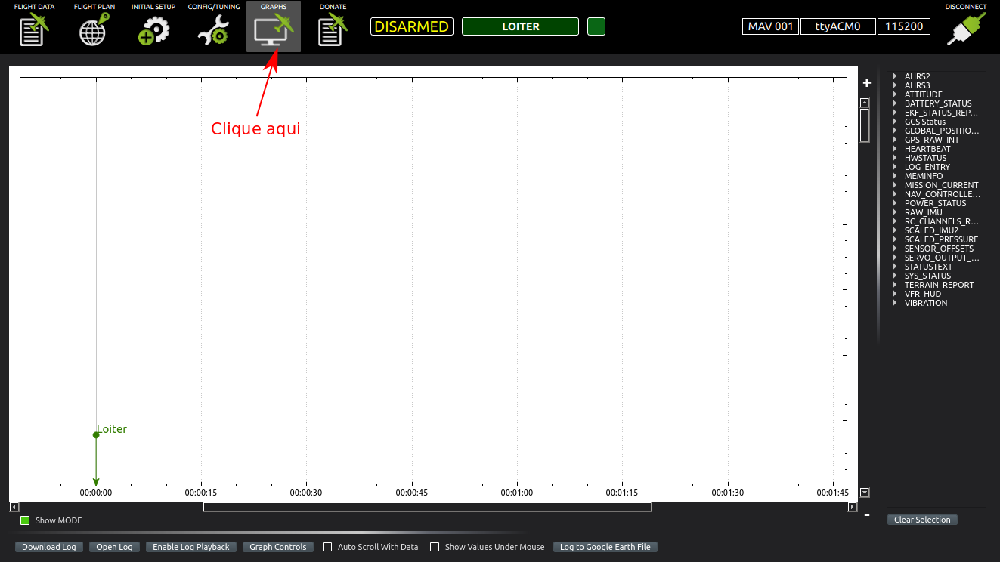
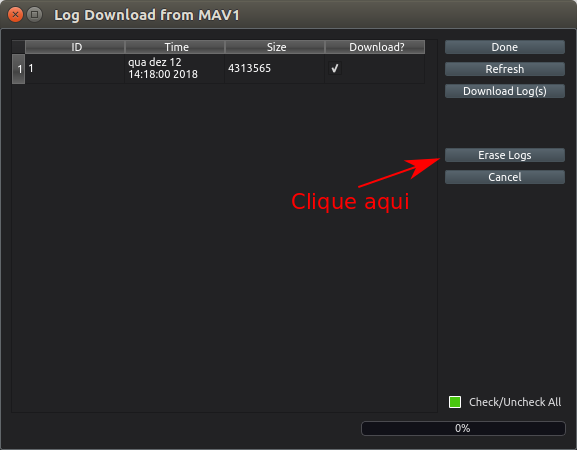
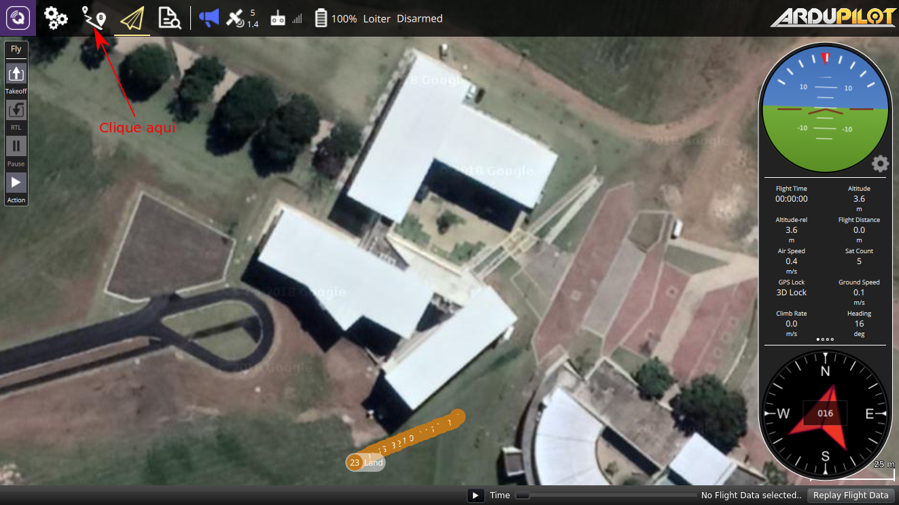
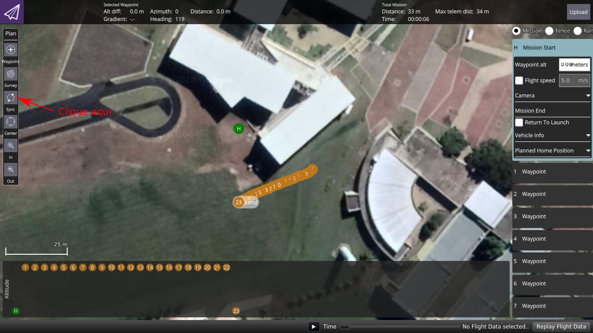
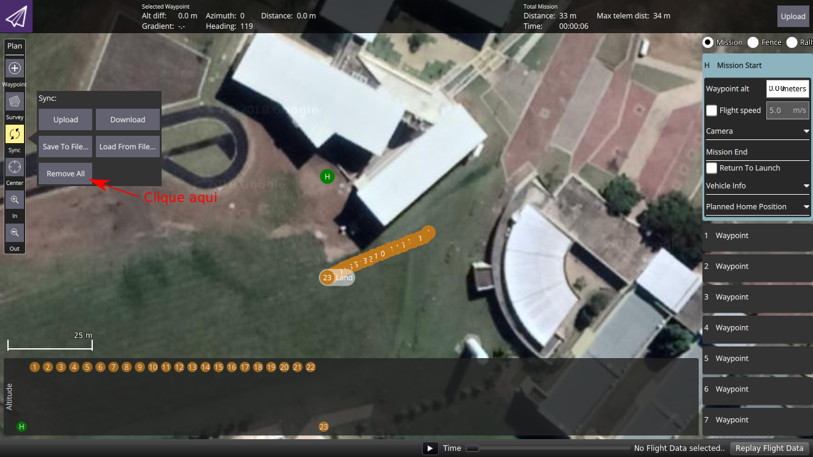
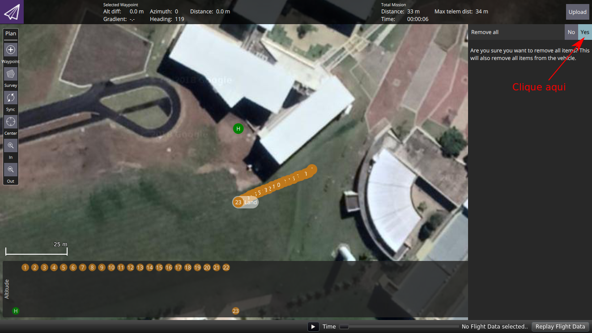

# SPECIFICATIONS

## Hardware 

GPS

| Tipo de Componente  | Modelo          | Frequência de Operação | Precisão Horizontal | Precisão Velocidade | Precisão de Orientação | Máxima Velocidade | Sistema de Coordenadas | GPSs Suportados               | Temperatura de Operação  |
|---------------------|-----------------|------------------------|---------------------|---------------------|------------------------|-------------------|------------------------|-------------------------------|--------------------------|
| GPS                 | u-blox NEO-6M   | 5Hz                    | 2.5m                | 0.10m/s             | 0.5 graus              | 500m/s            | WGS-84                 | US-Based GPS                  | -40°C a 85°C             |
| GPS                 | u-blox NEO-M8N  | 10Hz                   | 2.5m                | 0.05m/s             | 0.3 graus              | 500m/s            | WGS-84                 | GPS, Galileo, GLONASS, BeiDou | -40°C a 85°C             |

OBS: O GPS u-blox NEO-M8N segundo vários sites possui uma precisão de 0.9 metros, mas o datasheet garante um erro menor que 2.5 metros.

Bússola

| Tipo de Componente  | Modelo          | Frequência de Operação | Precisão de Orientação | Temperatura de Operação       |
|---------------------|-----------------|------------------------|------------------------|-------------------------------|
| Bússola             | HMC5883L        | 160Hz                  | 1 a 2 graus            | -30°C a 85°C                  |

OBS: A bússola HMC5883L é a mesma encontrada dentro dos módulos u-blox NEO-6M e u-blox NEO-M8N. 

MPU-6000 (Giroscópio e Acelerômetro)

| Tipo de Componente  | Modelo          | Eixos   | Frequência de Operação | Temperatura de Operação  |
|---------------------|-----------------|---------|------------------------|--------------------------|
| MPU-6000            | Giroscópio      | 3 Eixos | 4Hz a 8000Hz           | -40°C a 85°C             |
| MPU-6000            | Acelerômetro    | 3 Eixos | 4Hz a 1000Hz           | -40°C a 85°C             |

OBS: O MPU-6000 é encontrado dentro da APM v2.8 e dentro da Pixhawk v1.0. O Giroscópio L3GD20H é usado dentro da Pixhawk. O Acelerômetro LSM303D é usado dentro da Pixhawk.

MS5611 MEAS (Barômetro)

| Tipo de Componente  | Modelo    | Frequência de Operação | Temperatura de Operação | Pressão de Operação  | Precisão da Pressão  | Altitude de Operação^1 |
|---------------------|-----------|------------------------|-------------------------|----------------------|----------------------|------------------------|
| MS5611 MEAS         | Barômetro |                        | -40°C a 85°C            | 450 mbar a 1100 mbar | -1.5 mbar a 1.5 mbar | -900m a 6000m          |

OBS^1: A pressão ao nível do mar é de 1 atm, ou ainda, 1013,25 mbar. O valor de 450 mbar corresponde a altitude de 6000 metros. O valor de 1100 mbar corresponde a uma altitude de próxima a 900 metros abaixo do nível do mar.
OBS: O Barômetro (MS5611 MEAS) é utilizado na Pixhawk.

### Links

DataSheet GPS

* **M6N** -> https://www.u-blox.com/sites/default/files/products/documents/NEO-6_DataSheet_(GPS.G6-HW-09005).pdf
* **M8N** -> https://www.u-blox.com/sites/default/files/NEO-M8_DataSheet_%28UBX-13003366%29.pdf

DataSheet Compass

* **HMC5883L** -> https://cdn-shop.adafruit.com/datasheets/HMC5883L_3-Axis_Digital_Compass_IC.pdf
* **HMC5883L** -> https://cdn-learn.adafruit.com/downloads/pdf/adafruit-hmc5883l-breakout-triple-axis-magnetometer-compass-sensor.pdf

DataSheet MPU-6000

* **MPU-6000** -> https://store.invensense.com/datasheets/invensense/MPU-6050_DataSheet_V3%204.pdf

DataSheet L3GD20H (Giroscópio)

* **L3GD20H** -> https://www.pololu.com/file/0J731/L3GD20H.pdf

DataSheet LSM303D (Acelerômetro)

* **LSM303D** -> https://www.pololu.com/file/0J703/LSM303D.pdf

DataSheet MS5611 MEAS (Barômetro)

* **MS5611 MEAS** -> https://www.te.com/commerce/DocumentDelivery/DDEController?Action=showdoc&DocId=Data+Sheet%7FMS5611-01BA03%7FB3%7Fpdf%7FEnglish%7FENG_DS_MS5611-01BA03_B3.pdf%7FCAT-BLPS0036

DataSheet BeagleBone Black

* **BeagleBone Black** -> https://cdn.sparkfun.com/datasheets/Dev/Beagle/e14%20BBB_SRM_rev%200.9.pdf

## Software 

| Aplicação de Software | Função/Funcionalidade     | Frequência de Operação | Tipo | Observação                                |
|-----------------------|---------------------------|------------------------|------|-------------------------------------------|
| IFA                   | Monitoramento da Aeronave | 2Hz                    | GET  | Módulo IFA faz requisição ao módulo S2DK  |
| MOSA                  | Monitoramento da Aeronave | 2Hz                    | GET  | Módulo MOSA faz requisição ao módulo S2DK |

## Características das Implementações

Abaixo encontram-se algumas características das implementações versão UAV-Toolkit release 5.0.0.

| Software           | Número de Threads | Threads Paralelas | Números de Arquivos de Entrada | Números de Arquivos de Saída |
|--------------------|-------------------|-------------------|--------------------------------|------------------------------|
| UAV-IFA            | 12                | 8                 | 5                              | 4                            |
| UAV-MOSA           | 11                | 8                 | 12                             | 7                            |
| UAV-GCS            | 37                | 30                | 30                             | 6                            |
| UAV-S2DK           | 1                 | 1                 | 1                              | 0                            |
| Lib-UAV            | N/A               | N/A               | N/A                            | N/A                          |
| UAV-MissionCreator | 1                 | 1                 | 2                              | 12                           |
| UAV-Manager        | 7                 | ?                 | ?                              | ?                            |

OBS: A tabela acima não foi feita com muito rigor, dessa forma, pode haver algum equívoco.

## Rádio Controle 

Rádio Jesimar e USP

| SWC | SWD | Modo    |
|-----|-----|---------|
| 1   | 1   | LOITER  |
| 2   | 1   | RTL     |
| 3   | 1   | AUTO    |
| 1   | 2   | LOITER  |
| 2   | 2   | RTL     |
| 3   | 2   | AUTO    |

## Arquivos para Download

Abaixo estão listados alguns arquivos que podem ser interessantes fazer o download para posterior análise dos dados e escrita de artigos científicos.

* .bin -> arquivo com o log do voo. Conectar a Pixhawk no notebook via USB. Copiar usando APM Planner o arquivo .bin. Para isso vá em Aba Graphs -> Download Log -> Refresh -> Selecione -> Download Log(s). O arquivo irá em geral para a pasta ~/apmplanner2/dataflashLogs/.
* .tlog -> arquivo com o log do voo. Encontrado na pasta /UAV-Toolkit/Scripts/MyCopter/logs/DATA/
* .tlog.raw -> arquivo com o log do voo. Encontrado na pasta /UAV-Toolkit/Scripts/MyCopter/logs/DATA/
* .parm -> arquivo com os parâmetros do drone. Encontrado na pasta /UAV-Toolkit/Scripts/MyCopter/logs/DATA/
* routeGeo.txt -> Caso tenha usado CCQSP4m. Encontrado na pasta /UAV-Toolkit/Modules-MOSA/CCQSP4m/
* routeGeo*.txt -> Caso tenha usado HGA4m. Encontrado na pasta /UAV-Toolkit/Modules-MOSA/HGA4m/. Onde * significa todos os números.
* routeGeo.txt -> Caso tenha usado HGA4m. Encontrado na pasta /UAV-Toolkit/Modules-IFA/MPGA4s/
* log-aircraft?.csv -> arquivo de log do sistema UAV-Tookit. Onde ? significa o último número.
* log-overhead-ifa?.csv - > arquivo de log de overhead do sistema IFA. Onde ? significa o último número.
* log-overhead-mosa?.csv -> arquivo de log de overhead do sistema MOSA. Onde ? significa o último número.
* .h264 -> se fez vídeo. Encontrado na pasta /UAV-Toolkit/Modules-Global/Camera/videos/
* .jpg -> se retirou foto. Encontrado na pasta /UAV-Toolkit/Modules-Global/Camera/pictures/
* .jpg -> se retirou fotos em sequência. Encontrado na pasta /UAV-Toolkit/Modules-Global/Camera/photos-in-sequence/
* config-global.properties -> arquivo de properties com dados de configuração usados no voo real. Encontrado na pasta /UAV-Toolkit/Modules-Global/
* config-param.properties -> arquivo de properties com dados dos parâmetros usados no voo real. Encontrado na pasta /UAV-Toolkit/Modules-Global/

## Como limpar os Logs da Pixhawk

Abaixo estão os seguintes passos para você limpar uma missão no piloto automático Pixhawk. Estes passos foram necessários, pois de alguma forma a Pixhawk estava fazendo um merge das missões (logs).
Os passos abaixo foram usando os softwares APM Planner 2 e QGroundControl. Estes passos podem ser feitos usando apenas o QGroundControl também.

As duas próximas figuras mostram como apagar o arquivo .bin.

As três próximas figuras mostram como apagar a missão do piloto automático.

## Bug de altitude

Caso o Drone estaja fazendo uma missão e o mesmo não atinja a altura correta no momento da decolagem faça o seguinte: 
Pela estação de controle, QGroundControl por exemplo, mude para Loiter dê throttle pelo controle e então volte pela estação de controle para o modo
AUTO.
