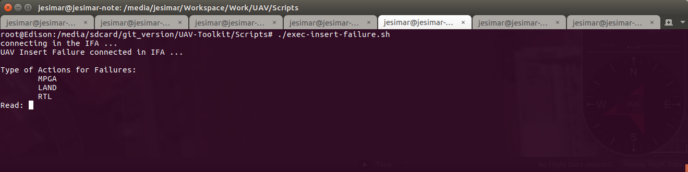

# UAV-Insert-Failure

Projeto escrito em Java usando a IDE Netbeans para inserção de falhas de forma manual no drone.

## Como Executar

Para executar este código, primeiramente, deve-se executar os seguintes scripts (localizados na pasta Scripts):

Forma 1 -> Execução em SITL-PC (PC - Personal Computer):

1. ./exec-sitl.sh                  (PC)
2. ./exec-mavproxy-local.sh        (PC)
3. ./exec-soa-interface.sh         (PC)
4. ./exec-ifa.sh                   (PC)
5. ./exec-insert-failure.sh        (PC)
6. ./exec-mosa.sh                  (PC)

Forma 2 -> Execução em SITL-EDISON:

1. ./exec-sitl.sh                  (PC)
2. ./exec-mavproxy-edison-sitl.sh  (EDISON)
3. ./exec-soa-interface.sh         (EDISON)
4. ./exec-ifa.sh                   (EDISON)
5. ./exec-insert-failure.sh        (EDISON)
6. ./exec-mosa.sh                  (EDISON)

Forma 3 -> Execução no Drone na EDISON:

1. ./exec-mavproxy-edison.sh       (EDISON)
2. ./exec-soa-interface.sh         (EDISON)
3. ./exec-ifa.sh                   (EDISON)
4. ./exec-insert-failure.sh        (EDISON)
5. ./exec-mosa.sh                  (EDISON)

OBS: Deve-se executar cada um desses scripts em um terminal diferente.



## Arquivos de Entrada

No diretório principal desse projeto existe um arquivo de propriedades (config.properties), onde se define o IP da máquina e a porta usada na comunicação.
Edite esse arquivo caso deseje executar esse código de outro computador remotamente.

```
prop.host=localhost
prop.port=5556
```

## Ações Possíveis

As seguintes ações são possíveis de serem chamadas a qualquer instante desde que aeronave esteja em voo:

* MPGA -> Simula que a aeronave sofreu uma falha e deve pousar usando o algoritmo MPGA4s.
* LAND -> Simula que a aeronave sofreu uma falha e deve pousar na vertical.
* RTL -> Simula que a aeronave sofreu uma falha e deve fazer um Return To Launch (RTL).

Para chamar alguma dessas ações basta digitar o nome delas e teclar enter:
