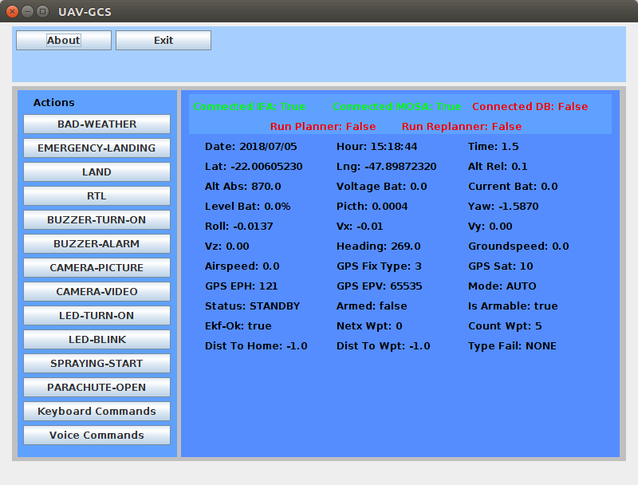

# UAV-GCS

Projeto escrito em Java usando a IDE Netbeans para interação com os sistemas UAV-IFA e UAV-MOSA.

## Como Executar

Para executar este código, primeiramente, deve-se executar os seguintes scripts (localizados na pasta Scripts):

Forma 1 -> Execução em SITL (Executado no PC - Personal Computer):

1. ./exec-sitl.sh                  (PC)
2. ./exec-mavproxy-sitl.sh         (PC)
3. ./exec-s2dk.sh                  (PC)
4. ./exec-ifa.sh                   (PC)
5. ./exec-gcs.sh                   (PC)
6. ./exec-mosa.sh                  (PC)

Forma 2 -> Execução em HITL (Executado no CC - Companion Computer):

1. ./exec-sitl.sh                  (PC)
2. ./exec-mavproxy-hitl.sh         (CC)
3. ./exec-s2dk.sh                  (CC)
4. ./exec-gcs.sh                   (PC)
5. ./exec-ifa.sh                   (CC)
6. ./exec-mosa.sh                  (CC)

Forma 3 -> Execução REAL_FLIGHT (Executado no Drone no CC):

1. ./exec-mavproxy-real-*.sh       (CC)
2. ./exec-s2dk.sh                  (CC)
3. ./exec-gcs.sh                   (PC)
4. ./exec-ifa.sh                   (CC)
5. ./exec-mosa.sh                  (CC)

OBS: Deve-se executar cada um desses scripts em um terminal diferente.

OBS: Você pode abrir/executar também uma estação de controle de solo para acompanhar a execução da missão, com por exemplo, o QGroundControl, APM Planner 2.0 ou Mission Planner.

Abaixo encontra-se uma tela do sistema em execução.



## Arquivos de Entrada

No diretório principal desse projeto existe um arquivo de propriedades (config.properties), em que se define o IP da máquina e a porta usada na comunicação.
Edite esse arquivo caso deseje executar esse código de outro computador remotamente.

```
prop.general.hasDB=false
prop.general.hasGoogleMaps=false
prop.ifa.host=192.168.43.8
prop.ifa.port=5556
prop.mosa.host=192.168.43.8
prop.mosa.port=5557
prop.od.host=192.168.205.105
prop.od.port=3306
prop.od.user_email=jesimar.arantes@gmail.com
```

Um outro arquivo usado é o google-maps.html, localizado no presente diretório, que contém um mapa de onde está sendo realizada a missão. 
Para a utilização desse arquivo deve-se habilitar a flag hasGoogleMaps no arquivo de entrada acima.

## Ações Possíveis

As seguintes ações são possíveis de serem chamadas a qualquer instante desde que aeronave esteja em voo:

* BAD-WEATHER -> Envia informações para a aeronave informando que o tempo está ruim.
* EMERGENCY-LANDING -> Simula que a aeronave sofreu uma falha e deve pousar usando o algoritmo (MPGA4s, GA4s, DE4s ou GH4s) especificado na pasta do sistema IFA.
* LAND -> Simula que a aeronave sofreu uma falha e deve pousar na vertical.
* RTL -> Simula que a aeronave sofreu uma falha e deve fazer um Return To Launch (RTL).
* BUZZER-TURN-ON -> Aciona o mecanismo de ligar o buzzer.
* BUZZER-ALARM -> Aciona o mecanismo de alarme do buzzer.
* CAMERA-PICTURE -> Aciona o mecanismo de tirar foto com a câmera.
* CAMERA-VIDEO -> Aciona o mecanismo de ligar o vídeo da câmera.
* LED-TURN-ON -> Aciona o mecanismo de acender o led.
* LED-BLINK -> Aciona o mecanismo de led-blink.
* SPRAYING-START -> Aciona o mecanismo de pulverização.
* PARACHUTE-OPEN -> Aciona o mecanismo de paraquedas.

Os seguites métodos podem ser utilizados para controlar o drone:

* **Keyboard-Commands** -> Utiliza comandos do teclado para controlar a aeronave. Veja imagem abaixo.
* **Voice-Commands** -> Utiliza comandos de voz para controlar a aeronave. Veja imagem abaixo.

 
