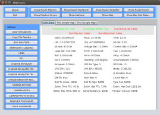
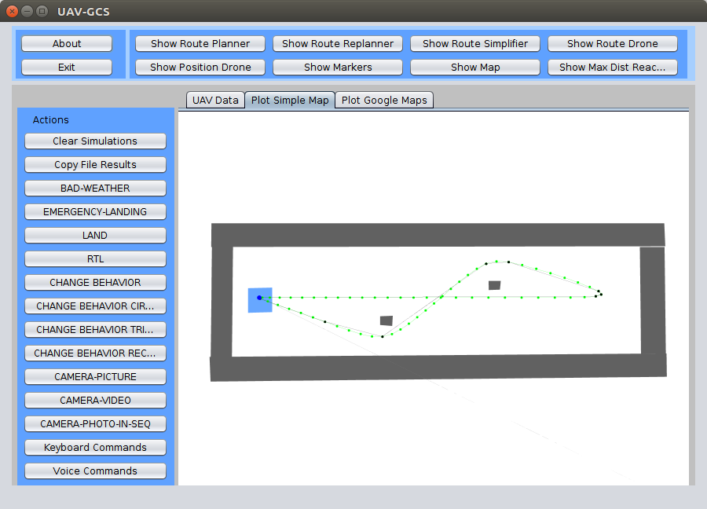
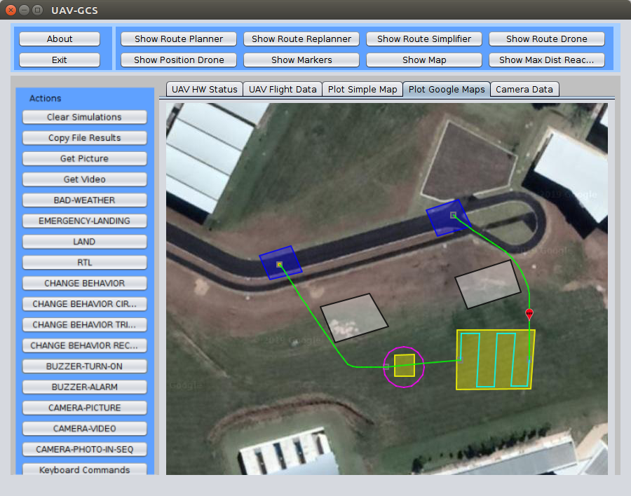
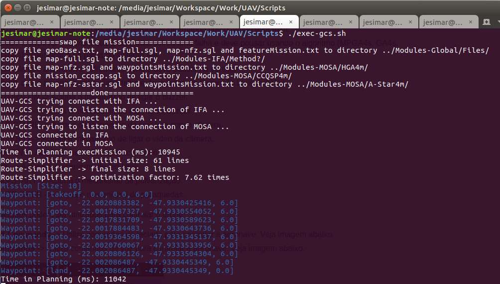
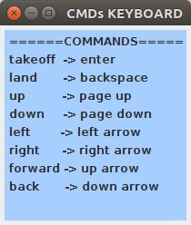
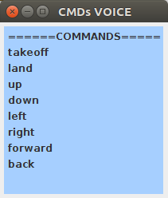

# UAV-GCS

O UAV-GCS é um Estação de Controle em Solo, ou ainda, uma Ground Control Station (GCS) para acompanhamento/visualização/interação com o piloto automático e os sistemas MOSA e IFA.

O projeto foi escrito em Java usando a IDE Netbeans.

## Instalação

Não necessita de instalação basta baixar o projeto em seu computador e usar. 
Necessita ter o Java JRE instalado uma vez que é uma aplicação Java.

## Como Executar

Existem três formas diferentes de executar o sistema que são: 

* SITL - Software-In-The-Loop - Tem que ter o sistema apenas no seu computador. O drone e os sensores são apenas simulado.
* HITL - Hardware-In-The-Loop - Tem que ter o sistema no seu computador e em algum Companion Computer (CC). O drone é simulado, mas os sensores são reais.
* REAL_FLIGH - Voo Real - Tem que ter o sistema no seu computador, no Companion Computer (CC) e ter um drone real. O drone é real e todos os sensores.

Para executar este código, primeiramente, deve-se executar os seguintes scripts (localizados na pasta /UAV-Toolkit/Scripts):

Forma 1 -> Execução em SITL (Executado no PC - Personal Computer):

1. ./exec-sitl.sh                  (PC)
2. ./exec-mavproxy-sitl.sh         (PC)
3. ./exec-s2dk.sh                  (PC)
4. ./exec-ifa.sh                   (PC)
5. ./exec-gcs.sh                   (PC)
6. ./exec-mosa.sh                  (PC)

Forma 2 -> Execução em HITL (Executado no PC e CC - Companion Computer):

1. ./exec-sitl.sh                  (PC)
2. ./exec-mavproxy-hitl.sh         (CC)
3. ./exec-s2dk.sh                  (CC)
4. ./exec-gcs.sh                   (PC)
5. ./exec-ifa.sh                   (CC)
6. ./exec-mosa.sh                  (CC)

Forma 3 -> Execução REAL_FLIGHT (Executado no PC e CC com Drone real):

1. ./exec-mavproxy-real-*.sh       (CC)
2. ./exec-s2dk.sh                  (CC)
3. ./exec-gcs.sh                   (PC)
4. ./exec-ifa.sh                   (CC)
5. ./exec-mosa.sh                  (CC)

OBS: Deve-se executar cada um desses scripts em um terminal diferente.

OBS: Você pode abrir/executar também uma outra estação de controle de solo para acompanhar a execução da missão, com por exemplo, o QGroundControl, APM Planner 2.0 ou Mission Planner.

## Interface do Sistema

Abaixo encontra-se duas telas com a GUI do sistema em execução.

| Tela com diversos dados do UAV       | Tela com plot da missão na Graphics2D | Tela com plot da missão no Google Maps |
|--------------------------------------|---------------------------------------|----------------------------------------|
|          |           |            |

| Tela com diversos dados do UAV       | Tela com plot da missão na Graphics2D | Tela com plot da missão no Google Maps |
|--------------------------------------|---------------------------------------|----------------------------------------|
|          |           |            |

OBS: O sistema de plot na Graphics2D e do Google Maps são invertidos, com impacto apenas visual.

Abaixo encontra-se um print da saída na linha de comando dessa aplicação contendo alguns logs também importantes.



## Arquivos de Entrada

No diretório /UAV-Toolkit/Modules-Global/ existe um arquivo de propriedades (config-global.properties), em que se define o IP da máquina e a porta usada na comunicação.
Edite esse arquivo caso deseje executar esse código de outro computador remotamente. Abaixo estão os principais parâmetros que impactam o UAV-GCS, mas existem outros parâmetros utilizados.

```
prop.global.comm.host_ifa=localhost
prop.global.comm.host_mosa=localhost
prop.gcs.internet.has_googlemaps=TRUE
prop.gcs.od.has_db=FALSE
prop.gcs.od.host_od=192.168.205.105
prop.gcs.od.user_email=jesimar.arantes@gmail.com
```

Um outro arquivo usado é o /UAV-Toolkit/UAV-GCS/html/maps.html, localizado no presente diretório, que contém um mapa de onde está sendo realizada a missão. 
Para a utilização desse arquivo deve-se habilitar a flag hasGoogleMaps no arquivo de entrada acima.

## Ações Possíveis

As seguintes ações são possíveis de serem chamadas a qualquer instante desde que aeronave esteja em voo:

* Clear Simulations -> Limpa os arquivos de logs gerados nas simulações anteriores.
* Copy File Results -> Cópia todos os arquivos de logs gerados pela simulação/voo para a pasta /UAV-Toolkit/Results/.
* BAD-WEATHER -> Envia informações para a aeronave informando que o tempo está ruim.
* EMERGENCY-LANDING -> Simula que a aeronave sofreu uma falha e deve pousar usando o algoritmo (MPGA4s, GA4s, DE4s ou GH4s) especificado na pasta do sistema IFA.
* LAND -> Simula que a aeronave sofreu uma falha e deve pousar na vertical.
* RTL -> Simula que a aeronave sofreu uma falha e deve fazer um Return To Launch (RTL).
* CHANGE BEHAVIOR -> Troca o comportamento da aeronave durante o voo.
* CHANGE BEHAVIOR CIRCLE -> Troca o comportamento da aeronave durante o voo para voar em circulos.
* CHANGE BEHAVIOR TRIANGLE -> Troca o comportamento da aeronave durante o voo para voar em formato de triângulo.
* CHANGE BEHAVIOR RECTANGLE -> Troca o comportamento da aeronave durante o voo para voar em formato de quadrado.
* BUZZER-TURN-ON -> Aciona o mecanismo de ligar o buzzer.
* BUZZER-ALARM -> Aciona o mecanismo de alarme do buzzer.
* CAMERA-PICTURE -> Aciona o mecanismo de tirar foto com a câmera.
* CAMERA-VIDEO -> Aciona o mecanismo de ligar o vídeo da câmera.
* CAMERA-PHOTO-IN-SEQ -> Aciona o mecanismo de tirar uma sequência de fotos com a câmera.
* LED-TURN-ON -> Aciona o mecanismo de acender o led.
* LED-BLINK -> Aciona o mecanismo de led-blink.
* SPRAYING-START -> Aciona o mecanismo de pulverização.
* PARACHUTE-OPEN -> Aciona o mecanismo de paraquedas.

Os seguites métodos podem ser utilizados para controlar o drone:

* **Keyboard-Commands** -> Utiliza comandos do teclado para controlar a aeronave. Veja imagem abaixo.
* **Voice-Commands** -> Utiliza comandos de voz para controlar a aeronave. Veja imagem abaixo.

| Tela da entrada de comandos de teclado | Tela da entrada de comandos de voz  |
|----------------------------------------|-------------------------------------|
|   |   |


OBS: Para a utilização de Keyboard-Commands e Voice-Commands é recomendado mudar o sistema para o modo CONTROLLER no arquivo config-global.properties.
