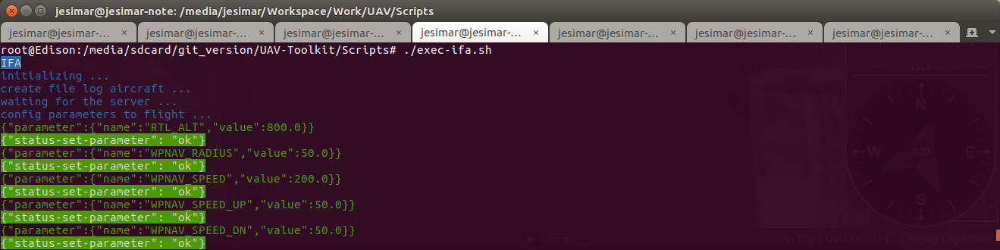

# UAV-IFA

O UAV-IFA é uma implementação para monitoramento da segurança em voo do drone através da implementação do sistema *In-Flight Awareness* (IFA) [[Link](http://www.teses.usp.br/teses/disponiveis/55/55134/tde-03122015-105313/pt-br.php)].

O projeto foi escrito em Java usando a IDE Netbeans.

## Instalação

Não necessita de instalação, basta baixar o projeto em seu computador e usar. Necessita apenas ter o Java JRE instalado uma vez que é uma aplicação Java.

## Como Executar

Existem três formas diferentes de executar o sistema que são: 

* **SITL** - Software-In-The-Loop - Tem que ter o sistema apenas no seu computador. O drone e os sensores são apenas simulados.
* **HITL** - Hardware-In-The-Loop - Tem que ter o sistema no seu computador e em algum Companion Computer (CC). O drone e o AP são simulados, mas o CC e os sensores são reais.
* **REAL_FLIGH** - Voo Real - Tem que ter o sistema no seu computador, no Companion Computer (CC) e ter um drone real. O drone e todos os sensores são dispositivos reais.

Para executar esse código, primeiramente, deve-se executar os seguintes scripts (localizados na pasta /UAV-Toolkit/Scripts/):

* **Forma 1** -> Execução SITL (Executado no PC - Personal Computer):

   1. ./exec-sitl.sh                  (PC)
   2. ./exec-mavproxy-sitl.sh         (PC)
   3. ./exec-s2dk.sh                  (PC)
   4. ./exec-ifa.sh                   (PC)

* **Forma 2** -> Execução HITL (Executado no PC e CC - Companion Computer):

   1. ./exec-sitl.sh                  (PC)
   2. ./exec-mavproxy-hitl.sh         (CC)
   3. ./exec-s2dk.sh                  (CC)
   4. ./exec-ifa.sh                   (CC)

* **Forma 3** -> Execução REAL_FLIGHT (Executado no PC e CC com Drone real):

   1. ./exec-mavproxy-real-*.sh       (CC)
   2. ./exec-s2dk.sh                  (CC)
   3. ./exec-ifa.sh                   (CC)

:warning: **OBS:** Deve-se executar cada um desses scripts em um terminal diferente.

:warning: **OBS:** Para que a aeronave faça algo efetivamente deve-se executar também o sistema MOSA.

:warning: **OBS:** Você pode abrir/executar também uma estação de controle de solo para acompanhar a execução da missão, como por exemplo, o QGroundControl, APM Planner 2.0 ou Mission Planner.

## Interface do Sistema

Essa aplicação não possui interface gráfica. Abaixo encontra-se um print da saída na linha de comando dessa aplicação contendo alguns logs importantes.



## Arquivos de Entrada

No diretório /UAV-Toolkit/Modules-Global/ tem-se um arquivo de propriedades (config-global.properties), em que se define que tipo algoritmo será executado, em caso de falha crítica, entre outras configurações do sistema IFA.

Abaixo estão os principais parâmetros do sistema IFA (existem outros parâmetros usados). 

```
prop.ifa.global.system_exec=REPLANNER

prop.ifa.replanner.local_exec=ONBOARD
prop.ifa.replanner.method=MPGA4s
prop.ifa.replanner.cmd_exec=./exec-replanner.sh
prop.ifa.replanner.time_exec=1.0
prop.ifa.replanner.number_waypoints=30
prop.ifa.replanner.delta=0.01
prop.ifa.replanner.type_altitude_decay=CONSTANT
```

## Arquivos de Saída

Como saída desse sistema, temos dois arquivos que ficam armazenados na pasta: /UAV-Toolkit/UAV-IFA/

O seguinte arquivo de saída (log-overhead-ifa*.csv) em formato CSV é gerado: 

```
Type-of-Method;Requisition-URL;Time-In-MilliSeconds
POST;/set-parameter/;322
POST;/set-parameter/;232
POST;/set-parameter/;348
GET;/get-parameters/;208
GET;/get-home-location/;419
GET;/get-all-sensors/;27
GET;/get-distance-to-home/;60
...
GET;/get-all-sensors/;44
```

Este arquivo contém basicamente três campos o tipo de comando (tipo de método), o nome do comando (nome da URL) e o tempo gasto (overhead) em milissegundos (ms) para concluir o comando.

Um outro arquivo de saída gerado é o log-aircraft*.csv que também utiliza o formato CSV e possui o seguinte aspecto:

```
time;lat;lng;alt_rel;alt_abs;voltage_bat;current_bat;level_bat;pitch;yaw;roll;vx;vy;vz;fixtype;satellitesvisible;eph;epv;heading;groundspeed;airspeed;mode;system-status;armed;is-armable;ekf-ok
0.0;-22.0059325;-47.8987095;0.19;870.18;12.587;0.0;100.0;0.005283987149596214;0.4842582046985626;-0.008793571032583714;0.0;-0.31;0.05;3;10;121;65535;27.0;0.0;0.0;STABILIZE;STANDBY;false;true;true
0.5;-22.0059325;-47.8987095;0.19;870.18;12.587;0.0;100.0;0.005300106015056372;0.48441487550735474;-0.008804457262158394;0.0;-0.31;0.05;3;10;121;65535;27.0;0.0;0.0;STABILIZE;STANDBY;false;true;true
1.0;-22.0059325;-47.8987095;0.19;870.18;12.587;0.0;100.0;0.005296911578625441;0.48446178436279297;-0.008803870528936386;0.0;-0.31;0.05;3;10;121;65535;27.0;0.0;0.0;STABILIZE;STANDBY;false;true;true
1.5;-22.0059325;-47.8987095;0.19;870.18;12.587;0.0;100.0;0.005296911578625441;0.48446178436279297;-0.008803870528936386;0.0;-0.31;0.05;3;10;121;65535;27.0;0.0;0.0;STABILIZE;STANDBY;false;true;true
...
9.0;-22.0059325;-47.8987095;0.19;870.18;12.587;0.0;100.0;0.005296911578625441;0.48446178436279297;-0.008803870528936386;0.0;-0.31;0.05;3;10;121;65535;27.0;0.0;0.0;STABILIZE;STANDBY;false;true;true
```
