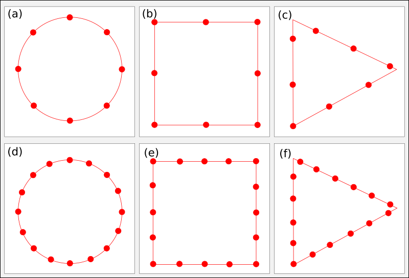

# UAV-Routes-Standard
 
Este projeto foi desenvolvido em C usando o IDE [Geany](https://www.geany.org/). 
Esse projeto auxilia a projetar rotas para VANT com formatos regulares como círculos, triângulos e retângulos. 
De acordo com uma discretização especificada (quantidade de waypoints). 
As rotas são projetadas sempre em uma altitude de voo cruzeiro especificada e os dados são em coordenadas cartesianas (x, y, z) e não em coordenadas geográficas (lat, lng, alt). 
As dimensões (tamanhos) assumidos na rota também podem ser alteradas. 

## Como Compilar

Para compilar o código digite no terminal: 

```
make all
```

Para apagar o código digite no terminal:

```
make clean
```

## Arquivos de Entrada

Existe um arquivo de configuração (config.txt) de parâmetros de entrada do algoritmo:

```
#IS_PRINT
0
#POS_Z
10
#RADIUS_CIRCLE
10
#BASE_TRIANGLE
20
#BASE_RECTANGLE
20
#IS_GEOGRAPHICAL
true
-22.00210193071075
-47.93339136244188
```

O valor de IS_PRINT pode ser apenas 0 (false) e 1 (true). Os valores restantes podem ser quaisquer valores reais. As linhas de comentários não podem ser trocadas por outros comentários, mas podem ser suprimidas se desejar, no entanto, os valores default do código serão utilizados.
Após ler IS_GEOGRAPHICAL deverão ser lidos um valor lógico indicando se está trabalhando em coordenadas geográficas. Caso sim, então serão lidos as coordenadas de latitude e longitude.

## Arquivos de Saída

Um conjunto de arquivos de saída (route*.txt) são gerados nas pastas Circle, Triangle, Rectangle.
Os arquivos de saída contém rotas calculadas em coordenadas cartesianas e coordenadas geográficas. O separador em coordenadas cartesianas e a "vírgula". O separador em coordenadas geográficas e o "ponto e vírgula". 

Abaixo encontra-se o arquivo route_rectangle_8wpt.txt.

```
0.00 0.00 10.00
0.00 10.00 10.00
0.00 20.00 10.00
10.00 20.00 10.00
20.00 20.00 10.00
20.00 10.00 10.00
20.00 0.00 10.00
10.00 0.00 10.00
0.00 0.00 10.00
```

Abaixo encontra-se o arquivo route_triangle_6wpt_geo.txt.

```
-22.00601058;-47.89870056;10.00
-22.00592060;-47.89870056;10.00
-22.00583062;-47.89870056;10.00
-22.00587561;-47.89861665;10.00
-22.00592060;-47.89853275;10.00
-22.00596559;-47.89861665;10.00
-22.00601058;-47.89870056;10.00
```

## Principais Funções do Programa

As funções que criam as rotas de circulo, triângulo e retângulo são respectivamente: 

```c
void createRouteCircle(int discretization, char name[]);
void createRouteTriangle(int discretization, char name[]);
void createRouteRectangle(int discretization, char name[]);

void createRouteCircleGeo(int discretization, char name[]);
void createRouteTriangleGeo(int discretization, char name[]);
void createRouteRectangleGeo(int discretization, char name[]);
``` 

As três primeiras funções criam as rotas em coordenadas cartesianas. 
Já as funções com "Geo" no nome criam as rotas em coordenadas geográficas.

## Rotas Geradas

Abaixo encontra-se algumas rotas gerados por esse software. As imagens (a), (b) e (c) foram geradas com 8 waypoints já as imagens (d), (e) e (f) foram geradas usando 16 waypoints.


