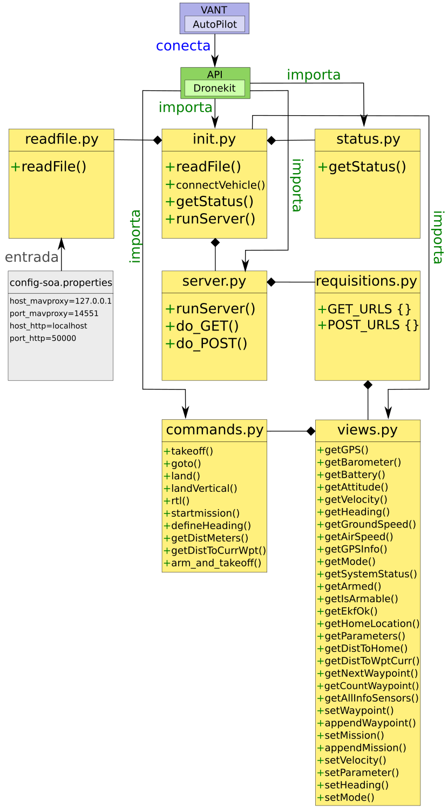

# UAV-SOA-Interface

Aplicação em Python que disponibiliza através do protocolo HTTP com métodos GET e POST um conjunto serviços sobre a biblioteca Dronekit. Estes serviços são providos através de uma Interface de Arquitetura Orientada a Serviços (SOA) do drone.

## Como Executar

Para executar este código, primeiramente, deve-se executar os seguintes scripts (localizados na pasta Scripts): 

Forma 1 -> Execução em SITL-PC (PC - Personal Computer):

1. ./exec-sitl.sh                    (PC)
2. ./exec-mavproxy-local.sh          (PC)
3. ./exec-soa-interface.sh           (PC)

Forma 2 -> Execução em SITL-CC (CC - Companion Computer):

1. ./exec-sitl.sh                    (PC)
2. ./exec-mavproxy-cc-sitl.sh        (CC)
3. ./exec-soa-interface.sh           (CC)

Forma 3 -> Execução no Drone no CC:

1. ./exec-mavproxy-cc-real-*.sh      (CC)
2. ./exec-soa-interface.sh           (CC)

Em seguida é necessário executar mais alguma aplicação que faça as requisições ao UAV-SOA-Interface, como exemplo, de aplicações tem-se: 
UAV-IFA, UAV-MOSA, UAV-Tests, UAV-Monitoring, UAV-PosAnalyser e UAV-Toolkit-C.


## Arquivo de Entrada

No diretório raiz tem-se um arquivo de propriedades (config-soa.properties), em que se define que os IPs e as portas usada na comunicação entre os sistemas. 

```
prop.global.host_mavproxy=127.0.0.1
prop.global.port_mavproxy=14551
prop.global.host_http=localhost
prop.global.port_http=50000
```

## Requisições:

Métodos GET: 

* '/get-gps/'
* '/get-barometer/'
* '/get-battery/'
* '/get-attitude/'
* '/get-velocity/'
* '/get-heading/'
* '/get-groundspeed/'
* '/get-airspeed/'
* '/get-gpsinfo/'
* '/get-mode/'
* '/get-system-status/'
* '/get-armed/'
* '/get-is-armable/'
* '/get-ekf-ok/'
* '/get-home-location/'
* '/get-parameters/'
* '/get-distance-to-home/'
* '/get-distance-to-waypoint-current/'
* '/get-next-waypoint/'
* '/get-count-waypoint/'
* '/get-all-sensors/'

Métodos POST:

* '/set-waypoint/'
* '/append-waypoint/'
* '/set-mission/'
* '/append-mission/'
* '/set-velocity/'
* '/set-parameter/'
* '/set-heading/'
* '/set-mode/'

## Como Fazer Requisições usando o Navegador (Browser):

Para fazer as requisições do tipo GET basta digitar algumas dos comandos abaixo na barra de endereços do Browser:

```
http://localhost:50000/get-gps/
http://localhost:50000/get-barometer/
http://localhost:50000/get-battery/
http://localhost:50000/get-attitude/
http://localhost:50000/get-velocity/
http://localhost:50000/get-heading/
http://localhost:50000/get-groundspeed/
http://localhost:50000/get-airspeed/
http://localhost:50000/get-gpsinfo/
http://localhost:50000/get-mode/
http://localhost:50000/get-system-status/
http://localhost:50000/get-armed/
http://localhost:50000/get-is-armable/
http://localhost:50000/get-ekf-ok/
http://localhost:50000/get-home-location/
http://localhost:50000/get-parameters/
http://localhost:50000/get-distance-to-home/
http://localhost:50000/get-distance-to-waypoint-current/
http://localhost:50000/get-next-waypoint/
http://localhost:50000/get-count-waypoint/
http://localhost:50000/get-all-sensors/
```

Para fazer as requisições do tipo POST apenas digitar os comandos abaixo na barra de endereços não é o suficiente, pois é necessário enviar o arquivo da mensagem junto:

```
http://localhost:50000/set-waypoint/
http://localhost:50000/append-waypoint/
http://localhost:50000/set-mission/
http://localhost:50000/append-mission/
http://localhost:50000/set-velocity/
http://localhost:50000/set-parameter/
http://localhost:50000/set-heading/
http://localhost:50000/set-mode/
```

## Diagrama de Classe

Abaixo encontra-se o diagrama de classe e dependência do UAV-SOA-Interface


